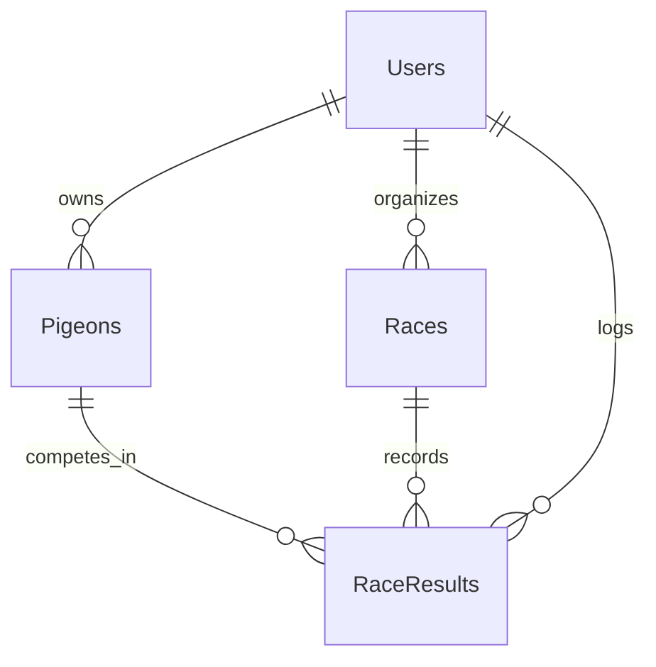

# PigeonPulse

A racing pigeon management application designed for pigeon fanciers to track pigeon performance, log race results, and analyze season performance.

## Problem Definition
Pigeon racing enthusiasts often face difficulties in tracking their pigeons' performances over multiple race seasons. The lack of a centralized system for managing pigeon data, recording results, and analyzing performance trends makes it hard to optimize training and racing strategies.

PigeonPulse aims to solve this problem by providing a dedicated digital platform where pigeon fanciers can:

- Register and log in to manage their racing pigeons.
- Create and schedule races for the racing season.
- Assign pigeons to races (basket pigeons).
- Log and analyze race results.
- View leaderboards and track performance trends.

## Priorities

### Must have
- A user must be able to register and log in.
- A user must be able to add, update, and remove pigeons.
- A user must be able to schedule and manage races.
- A user must be able to assign pigeons to races (basket pigeons).
- A user must be able to log race results.
- A user must be able to view race history.

### Should have

- Users should be able to view leaderboards for races.
- Users should be able to analyze pigeon performance across multiple races.
- Users should have access to a dashboard with summary statistics.

### Could have
- Graphical charts and insights on pigeon performance trends.
- Advanced AI-driven pigeon performance prediction.
- Support for different race distances and weather conditions.
- Mobile-friendly interface for on-the-go race logging.

### Will not have
- A built-in pigeon tracking GPS system.
- Social media integration or sharing features.

# Domain Model diagram
## Application

### Users:
Represents pigeon fanciers using the PigeonPulse system.
Each user has login credentials and a dashboard for tracking race data.

### Pigeons: 
Represents individual pigeons that belong to a user.
Each pigeon has a name, ring number, age, and race history.

### Races:
Represents scheduled races within a race season.
Each race has a date, distance, weather conditions, and a status.

### Leaderboards:
Represents rankings for a specific workout based on member results. Tracks score types, values, and positions for members.

### Race Results:
Represents pigeon performance in races.
Tracks race finish time, ranking position, and associated race details.
